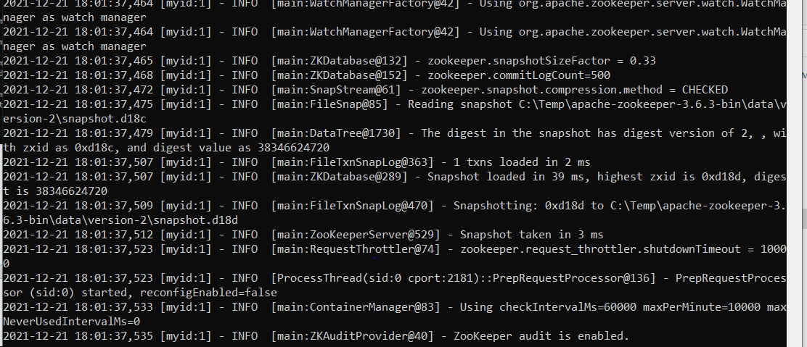
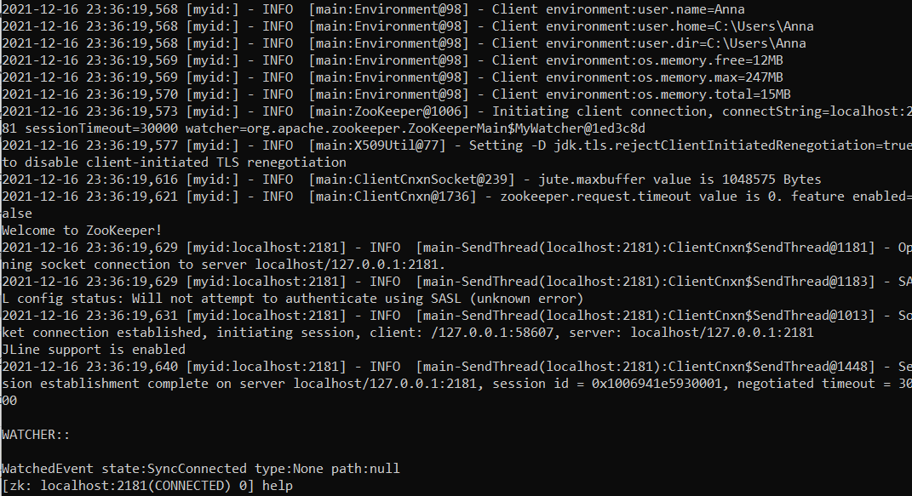
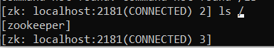
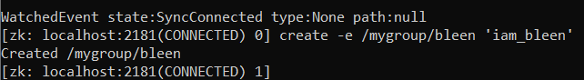
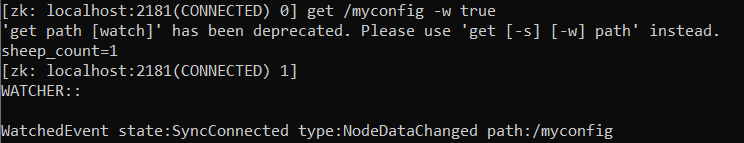
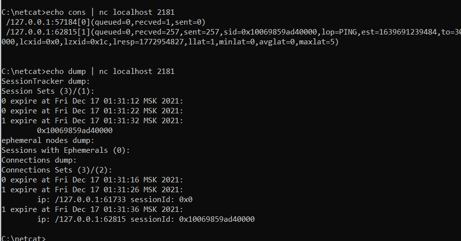

# Task 1

Скачала и установила ZooKeeper

Запустила сервер

Запустила интерактивную сессию ZooKeeper CLI

Команда help

Команды ls, get, set

Создаём два нумерованных узла, аварийно отключаем одного из клиентов

Создаём узел mygroup

Затем создаём двух новых клиентов и каждый из них создаёт узел

Прерываем выполнение одного из клиентов

И удаляем узел /megroup

Работаем с watch-триггером

#### Мониторинг ZooKeeper

